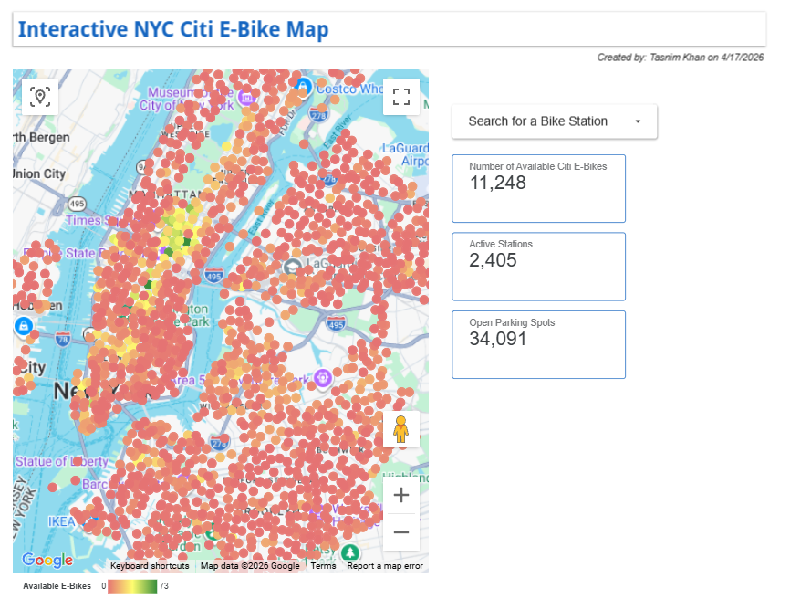

# NYC Citi Bike Live Data Pipeline
**Project Overview:**

This project is an end-to-end ELT pipeline that captures real-time bike availability across New York City. It moves by using Python to automate data collection and Google BigQuery for cloud storage.

**Tech Stack:**

Python: Data extraction (Requests) and transformation (Pandas).

Google BigQuery: Cloud data warehousing and time-series storage.

NYC Open Data (GBFS): Live API source.

**Key Features:**

Automated Merging: Performed a programmatic "VLOOKUP" to join live station status with geographic location data.

Cloud Scalability: Designed the pipeline to append data, allowing for historical trend analysis (e.g., peak-hour bike shortages).

Data Cleaning: Converted Unix timestamps to readable NYC time and filtered for active rental stations.

